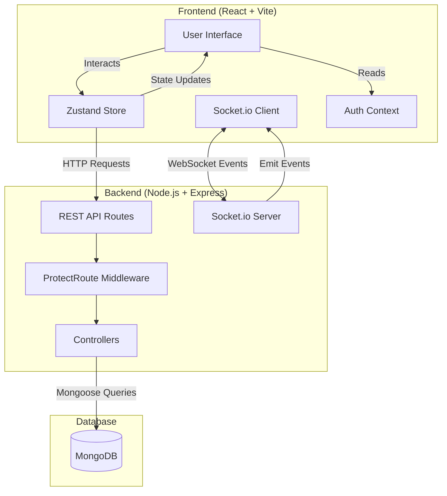
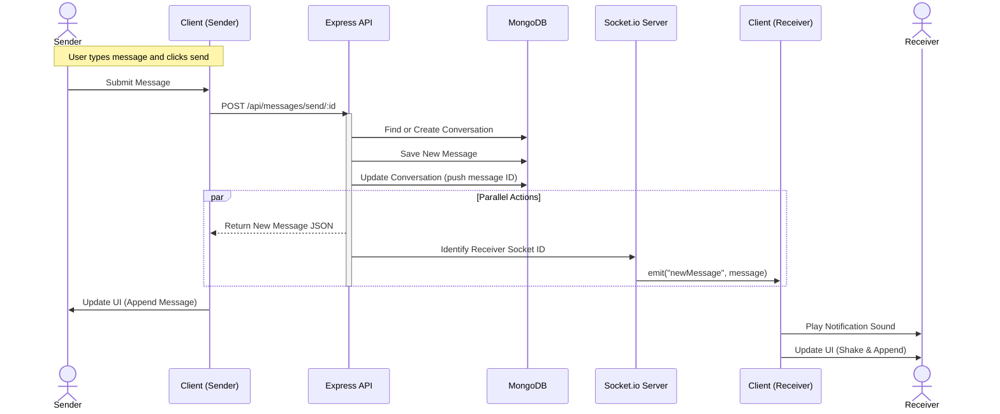
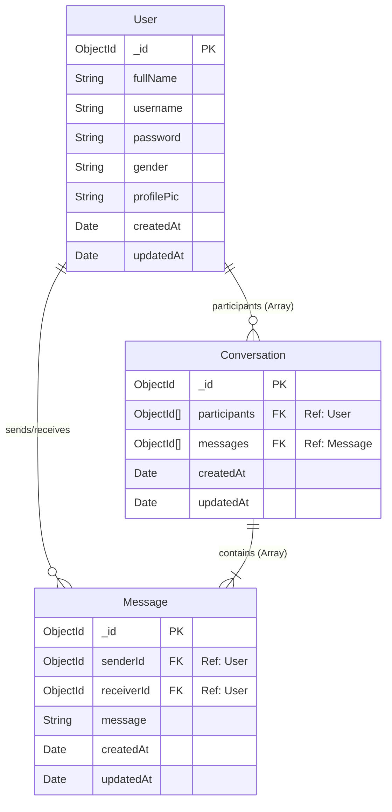
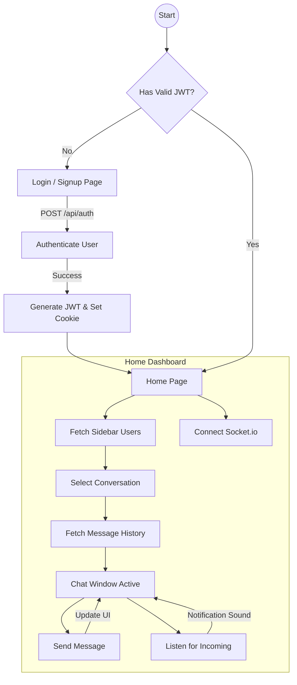

# Real-Time Chat Application

## Overview

This project is a real-time chat application built using the MERN (MongoDB, Express.js, React.js, Node.js) stack and Socket.io. It allows users to engage in real-time messaging with random active users. The application focuses on providing a seamless and responsive user experience with robust features for authentication and message handling.

### System Architecture Diagram


---

## Features

- **Real-Time Messaging:** Users can send and receive messages instantly.
- **User Authentication:** Secure user registration and login.
- **Dynamic Conversations:** Engage in multiple conversations simultaneously.
- **Responsive Design:** Optimized for various screen sizes and devices.
- **Scalable Backend:** Handles concurrent users efficiently.

### Sequence Diagram: Sending a Message


---

## Technology Stack

- **Frontend:** React.js, Tailwind CSS
- **Backend:** Node.js, Express.js
- **Database:** MongoDB
- **Real-Time Communication:** Socket.io
- **Authentication:** JSON Web Tokens (JWT)
---

## Database Schema


---
## Application Flow


---
## Live Demo
[click Here](https://chat-app-pooy.onrender.com)

## Installation
Clone the repository:

```bash
git clone https://github.com/Ujjwalprajapati16/chat-app.git
cd repo-name
```

Install dependencies:

For backend:
```bash
cd backend
npm install
```
For frontend:
```bash
cd frontend
npm install
```
Environment Variables:

Create a .env file in the backend directory and add the following:
```bash
MONGO_URI=your_mongo_db_connection_string
JWT_SECRET=your_jwt_secret
PORT=5000
```
Running the Application
Start the backend server:

```bash
cd backend
npm start
```
Start the frontend application:

```bash
cd frontend
npm start
```

Open your browser and navigate to:

```plaintext
http://localhost:3000
Usage
Sign Up: Register a new user account.
Log In: Authenticate with existing user credentials.
Start Chatting: Begin a conversation with active users.
Real-Time Updates: Experience real-time messaging with instant updates.
Contributing
```
##Fork the repository.
Create a new branch:
```bash
git checkout -b feature-branch
```
Make your changes and commit them:
```bash
git commit -m 'Add some feature'
```
Push to the branch:
```bash
git push origin feature-branch
```
Create a pull request.
License
This project is licensed under the MIT License.

##Contact
Email : ujjwalprajapati154@gmail.com
For any inquiries or issues, please contact [yourname@example.com].

